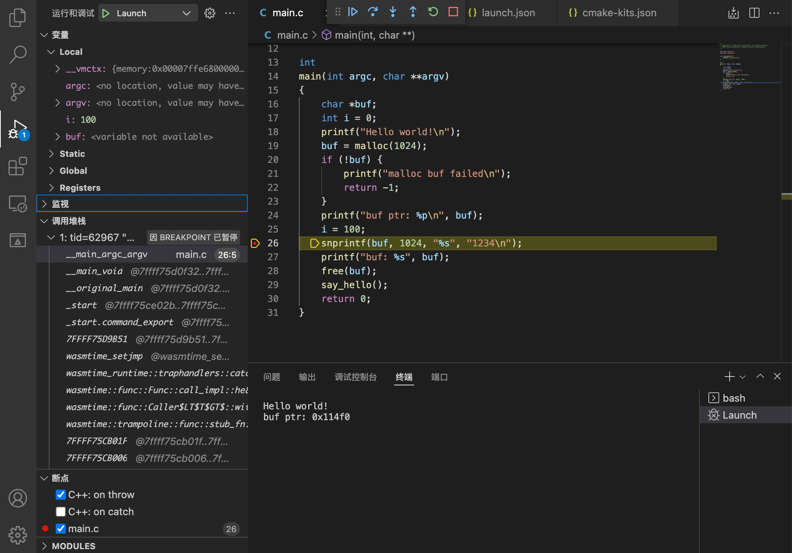

# Developing WebAssembly(WASI) Program With C/C++ In Visual Studio Code

[中文版本](docs/README_zh.md)

## Summary

Use CodeLLDB debugging WebAssembly WASI program in VSCode.

1. Add WASI-SDK toolchain to VSCode CMake Tools Kits.
2. Build C/C++ sources to WebAssembly binary file via WASI-SDK toolchain.
3. Attaching the LLDB to Wasmtime Runtime that executes the WebAssembly binary file.


## Dependents

* [WASI-SDK](https://github.com/WebAssembly/wasi-sdk/releases)
    > WASI-enabled WebAssembly C/C++ toolchain.

* [Wasmtime](https://github.com/bytecodealliance/wasmtime/releases)
    > Standalone JIT-style runtime for WebAssembly.


## VSCode Extensions

Install extension on Visual Studio Code:

* C/C++ Extension Pack
* CodeLLDB

## Setup VSCode workspace

### Setup CMake Tools extension configuration

Modify `${ROOT_PROJECT_DIR}/.vscode/cmake-kits.json` file for adding WASI-SDK toolchain to VSCode CMake Tools Kits.

Set `toolchainFile` to `${path_to_wasi_sdk_dir}/share/camke/wasi-sdk.cmake`

Set `cmakeSettings.WASI_SDK_PREFIX` to `${path_to_wasi_sdk_dir}`

Example:

```json
[
    {
        "name":"wasi-sdk",
        "toolchainFile": "/path/to/wasi_sdk_dir/share/cmake/wasi-sdk.cmake",
        "cmakeSettings": {
            "WASI_SDK_PREFIX":"/path/to/wasi_sdk_dir"
        }
    }
]
```

Select the `wasi-sdk` kit for CMake porject.

> ### [Select A Kit](https://code.visualstudio.com/docs/cpp/cmake-linux#_select-a-kit)
>
> Before you can use the CMake Tools extension to build a project, you need to configure it to know about the compilers on your system. Do that by scanning for 'kits'. A kit represents a toolchain, which is the compiler, linker, and other tools used to build your project. To scan for kits:
> 
> Open the Command Palette (⇧⌘P) and run CMake: Select a Kit. The extension will automatically scan for kits on your computer and create a list of compilers found on your system.
> 
> Select the compiler you want to use. For example, depending on the compilers you have installed, you might see something like:
> 
> 


### Setup Run And Debug configuration

To debug the WebAssembly binary file, we should setup the launch configuration.

Add lldb type launch item to `${ROOT_PROJECT_DIR}/.vscode/launch.json`

* Set `program` to Wasmtime runtime program path, rather than the WebAssembly binary file path. If the Wasmtime runtime program not in `PATH`, set it to the full path.

* Set `args` to `["-g", "${command:cmake.launchTargetPath}"]`. The `${command:cmake.launchTargetPath}` is a path of WebAssembly binary file made by the CMake build target.

  For more parameter details of Wasmtime runtime, please refer to the following information:
   * [Wasmtime runtime cli options](https://github.com/bytecodealliance/wasmtime/blob/main/docs/cli-options.md)
   * [WASI in Wasmtime runtime](https://github.com/bytecodealliance/wasmtime/blob/main/docs/WASI-tutorial.md#executing-in-wasmtime-runtime)


Example:

```json
{
    "version": "0.2.0",
    "configurations": [
        {
            "type": "lldb",
            "request": "launch",
            "name": "Launch",
            "program": "wasmtime",
            "args": ["run","-g","${command:cmake.launchTargetPath}"],
            "cwd": "${workspaceFolder}",
            "environment": [
                {
                    "name": "PATH",
                    "value": "${env:PATH}:${command:cmake.getLaunchTargetDirectory}"
                }
            ],
            "initCommands": [
                "settings set plugin.jit-loader.gdb.enable on"
            ]
        }
    ]
}
```

## Source Level Debugging

### CMake Project

We need to save DWARF debug information in the WebAssembly binary file for debugging needs.

Select CMake variant to `Debug` or `RelWithDebInfo`, the DEWARF debug infomation will be saved in the WebAssembly binary file.

If select `Release` or another variant, you should add `-g` to compiler flags.


### Breakpoint debugging

Like common C/C++ debugging in VSCode, set breakpoint and run.

