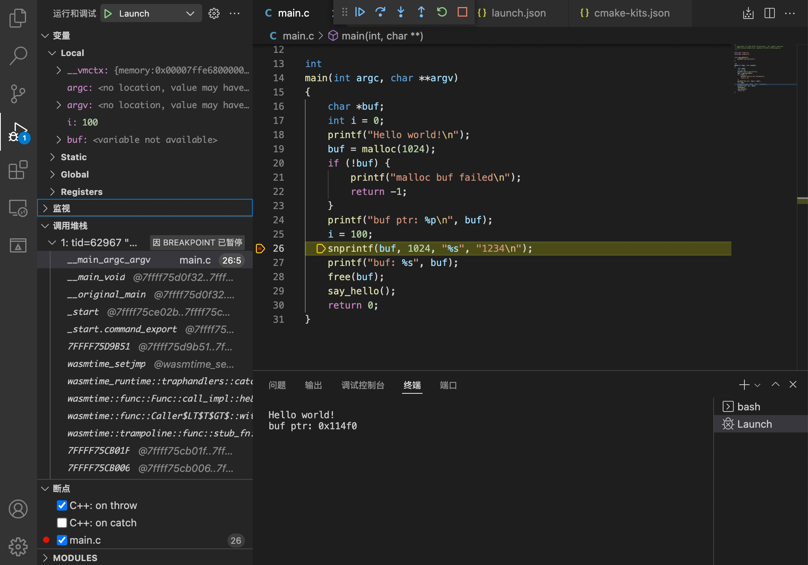

# 使用 Visual Studio Code 进行 C/C++ WebAssembly(WASI) 程序开发

## 过程概要

1. 添加 WASI-SDK 工具链到 VSCode CMake Tools 插件配置；
2. 使用 WASI-SDK 工具链构建 C/C++ 源码到 WebAssembly 二进制文件；
3. 使用 lldb 调试 Wasmtime，同时让 Wasmtime 加载构建出来的 WebAssembly 二进制文件。

创建 C/C++ CMake 工程的过程，参照 [Create a CMake project](https://code.visualstudio.com/docs/cpp/cmake-linux#_create-a-cmake-project)

## 依赖

* [WASI-SDK](https://github.com/WebAssembly/wasi-sdk/releases)
    > WASI-enabled WebAssembly C/C++ toolchain.

* [Wasmtime](https://github.com/bytecodealliance/wasmtime/releases)
    > Standalone JIT-style runtime for WebAssembly.

## VSCode 插件

在 Visual Studio Code 中安装以下插件：

* C/C++ Extension Pack
* CodeLLDB


## VSCode 工作区配置

### CMake Tools 配置

在工程的 .vscode 目录中创建 cmake-kits.json 文件，添加 WASI-SDK 工具链到 CMake Tools 的套件中。

设置 `toolchainFile` 为 WASI-SDK 目录下的 `share/cmake/wasi-sdk.cmake`，设置参数 `WASI_SDK_PREFIX` 为 WASI-SDK 目录路径.

如：
``` json
[
    {
        "name":"wasi-sdk",
        "toolchainFile": "/path/to/wasi_sdk_dir/share/cmake/wasi-sdk.cmake",
        "cmakeSettings": {
            "WASI_SDK_PREFIX":"/path/to/wasi_sdk_dir"
        }
    }
]
```

在 VSCode 的状态栏中，为 CMake 工程选择使用已添加的 `wasi-sdk` 套件


### 运行和调试配置

为了可以对已构建的程序进行调试，需要对启动参数进行配置。

在 .vscode 目录的 launch.json 文件中，添加 lldb 类型的启动条目:
* `program` 设置为 wasmtime 程序，如果 wamstime 不在 `PATH` 环境变量中，则需要设置为全路径
* `args` 设置为 `["-g","${command:cmake.launchTargetPath}"]`，如果程序存在额外的启动参数，则需要追加在后面
* 为 `initCommands` 添加 `settings set plugin.jit-loader.gdb.enable on`

完整配置如下

```json
{
    "version": "0.2.0",
    "configurations": [
        {
            "type": "lldb",
            "request": "launch",
            "name": "Launch",
            "program": "wasmtime",
            "args": ["run","-g","${command:cmake.launchTargetPath}"],
            "cwd": "${workspaceFolder}",
            "environment": [
                {
                    "name": "PATH",
                    "value": "${env:PATH}:${command:cmake.getLaunchTargetDirectory}"
                }
            ],
            "initCommands": [
                "settings set plugin.jit-loader.gdb.enable on"
            ]
        }
    ]
}
```


## 源码调试

### 保留调试符号信息

需要在 wasm 文件需要携带符号信息才可以进行调试。

CMake 的 varint 选项选择 `Debug` 或 `RelWithDebInfo`，wasm 文件将保留符号信息，可直接用于调试。

如果选择 `Release` 或其它类型，需要在编译器 Flags 中添加参数 `-g`。


### 断点调试

与普通的 C/C++ 代码一样，设置断点后运行即可

